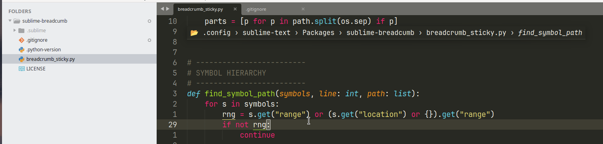

# Breadcrumb for Sublime Text

A clean and interactive **breadcrumb** that shows both the **file path** and the **current symbol hierarchy** at the top of the editor.

Powered by the LSP plugin for accurate, real-time symbol navigation.

  

## Features

- **Always visible** at the top of the view
- Real-time updates as you move the cursor
- Lightweight and fast
- Works great with Pyright, rust-analyzer, TypeScript, clangd, gopls, etc.

## What it does
 
Whenever you move the cursor, open a file, or switch tabs, a small popup appears at the top of the editor showing where you are:
 
```
📂 ~ › projects › myapp › src › utils.py › MyClass › render
```
 
---
 
## Default behaviour (no dependencies)
 
Out of the box, with no extra packages installed, the plugin works standalone and shows:
 
- **File path breadcrumb** — the last 5 segments of the current file's path, with `~` substituted for your home directory.
That's it. The popup fires on cursor move, file load, save, and tab switch.
 
---
 
## With LSP — symbol context
 
If you have the [LSP package](https://packagecontrol.io/packages/LSP) installed, the plugin will also show **symbol context**: the chain of symbols (class, function, method, block…) that enclose your cursor, queried live from your language server.
 
```
📂 ~ › projects › myapp › src › utils.py › MyClass › render
```
 
Without LSP, the symbol portion is simply absent — the file breadcrumb still shows normally.
 
> **Recommendation:** Install LSP for the full experience. Without it the plugin is still useful, but you lose the most valuable part.
 
### Setting up LSP
 
1. Open the Command Palette (`Ctrl+Shift+P` / `Cmd+Shift+P`)
2. Run **Package Control: Install Package**
3. Search for and install **LSP**
4. Install a language server for your language, for example:
   - **LSP-pyright** for Python
   - **LSP-typescript** for TypeScript / JavaScript
   - **LSP-clangd** for C / C++
   - **LSP-rust-analyzer** for Rust
The plugin automatically picks the best LSP session for the active file and uses `documentSymbols` to build the context chain. No extra configuration needed.
 
### Manual Installation

1. Download or clone this repository
2. Copy the folder into Sublime Text's `Packages` directory:
   - **Menu → Preferences → Browse Packages...**
3. Restart Sublime Text (or run `Package Control: Satisfy Dependencies`)

## Usage

- The breadcrumb appears automatically when you open a file with an active LSP session.
- Click on any part of the **file path** to open that folder.
- The display updates live on cursor movement.